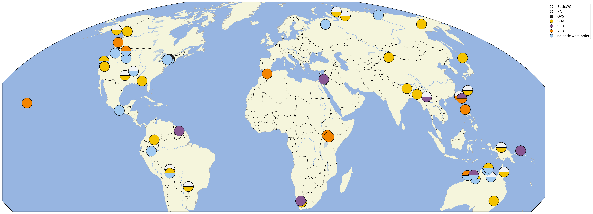

# CLDF dataset for the Grammars Across Time Analyzed (GATA) dataset

## How to cite

If you use these data please cite

- the original source
  > Frederic Blum, Carlos Barrientos, Adriano Ingunza, Damian E. Blasi & Roberto Zariquiey. Submitted. CLDF dataset for _Grammars Analyzed Across Time_ (GATA).
- the derived dataset using the DOI of the [particular released version](../../releases/) you were using

## Description

This dataset is licensed under a CC-BY license

## CLDF Datasets

The following CLDF datasets are available in [cldf](cldf):

- CLDF [Generic](https://github.com/cldf/cldf/tree/master/modules/Generic) at [cldf/Generic-metadata.json](cldf/Generic-metadata.json)
